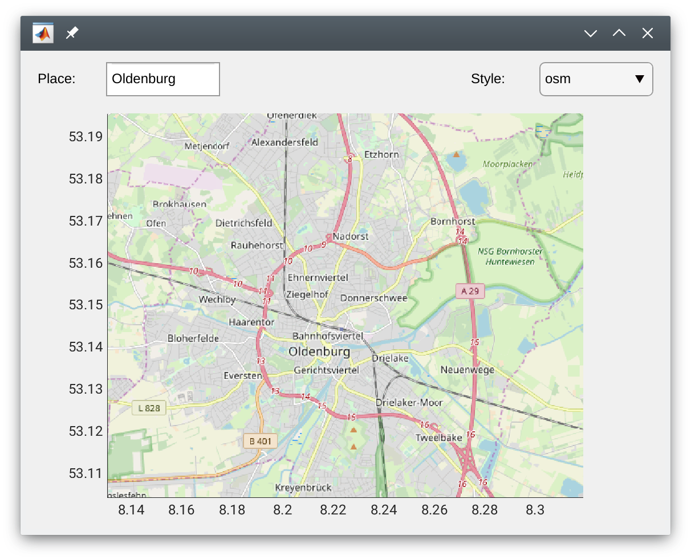

# Matlab-Map

`Map` draws a Map for a latitude/longitude on an axes. `Mapper` sets
up a simple GUI for a map, where the user can select a place and a
style for the map. The place will be converted to latitude/longitude
coordinates using the Google geocoding API.

```matlab
map = Mapper('Oldenburg');
```



The map consists of tiles downloaded from openstreetmap. Whenever the
axes limits are changed (pan/zoom), or coords is updated, new map
tiles are downloaded as appropriate. Map tiles are cached, and are
never re-downloaded.

The map will make sure that map tiles are always drawn at the bottom
of the draw stack, so that users can draw their own things on top of
the map.

The map tiles can be downloaded in one of several styles:

 - `'osm'` for OpenStreetMap's default look
 - `'hot'` for humanitarian focused OSM base layer
 - `'ocm'` for OpenCycleMap
 - `'opm'` for public transport map
 - `'landscape'` for Thunderforest landscape map
 - `'outdoors'` for Thunderforest outdoors map
 
(from: http://wiki.openstreetmap.org/wiki/Tiles)
   
All map drawing is done asynchronously, so user interaction with a GUI
is not interrupted by tile downloads.

### License

Copyright 2017 Bastian Bechtold

Redistribution and use in source and binary forms, with or without
modification, are permitted provided that the following conditions are
met:

1. Redistributions of source code must retain the above copyright
   notice, this list of conditions and the following disclaimer.

2. Redistributions in binary form must reproduce the above copyright
   notice, this list of conditions and the following disclaimer in the
   documentation and/or other materials provided with the
   distribution.

3. Neither the name of the copyright holder nor the names of its
   contributors may be used to endorse or promote products derived
   from this software without specific prior written permission.

THIS SOFTWARE IS PROVIDED BY THE COPYRIGHT HOLDERS AND CONTRIBUTORS
"AS IS" AND ANY EXPRESS OR IMPLIED WARRANTIES, INCLUDING, BUT NOT
LIMITED TO, THE IMPLIED WARRANTIES OF MERCHANTABILITY AND FITNESS FOR
A PARTICULAR PURPOSE ARE DISCLAIMED. IN NO EVENT SHALL THE COPYRIGHT
HOLDER OR CONTRIBUTORS BE LIABLE FOR ANY DIRECT, INDIRECT, INCIDENTAL,
SPECIAL, EXEMPLARY, OR CONSEQUENTIAL DAMAGES (INCLUDING, BUT NOT
LIMITED TO, PROCUREMENT OF SUBSTITUTE GOODS OR SERVICES; LOSS OF USE,
DATA, OR PROFITS; OR BUSINESS INTERRUPTION) HOWEVER CAUSED AND ON ANY
THEORY OF LIABILITY, WHETHER IN CONTRACT, STRICT LIABILITY, OR TORT
(INCLUDING NEGLIGENCE OR OTHERWISE) ARISING IN ANY WAY OUT OF THE USE
OF THIS SOFTWARE, EVEN IF ADVISED OF THE POSSIBILITY OF SUCH DAMAGE.
